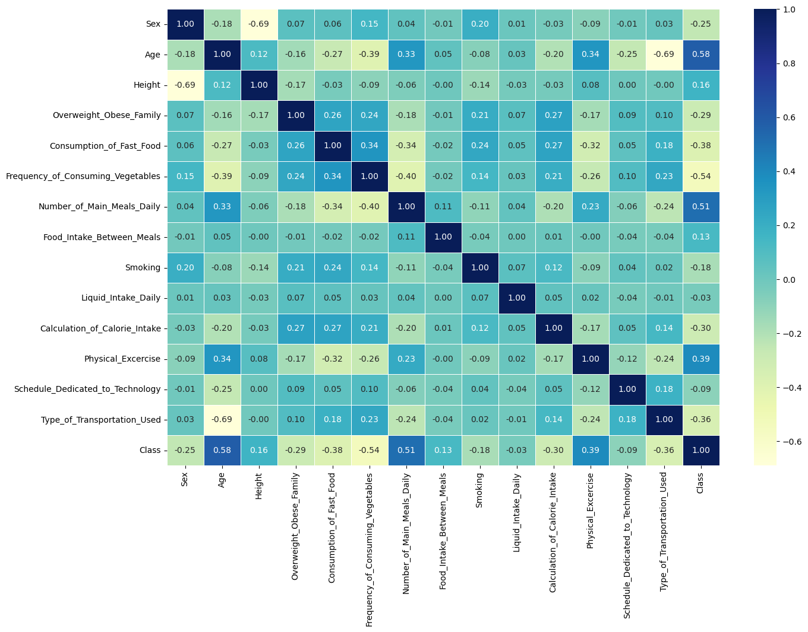
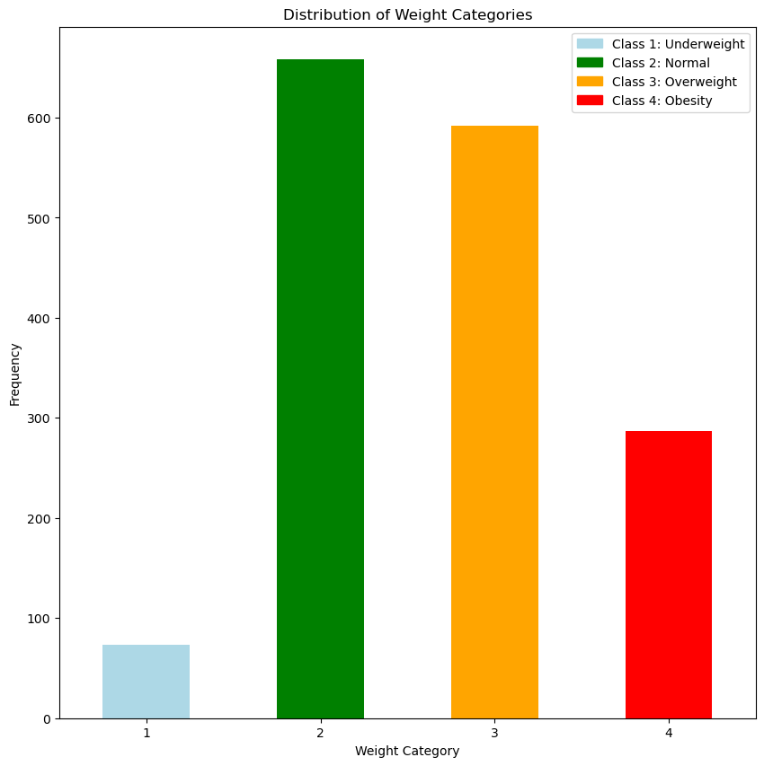
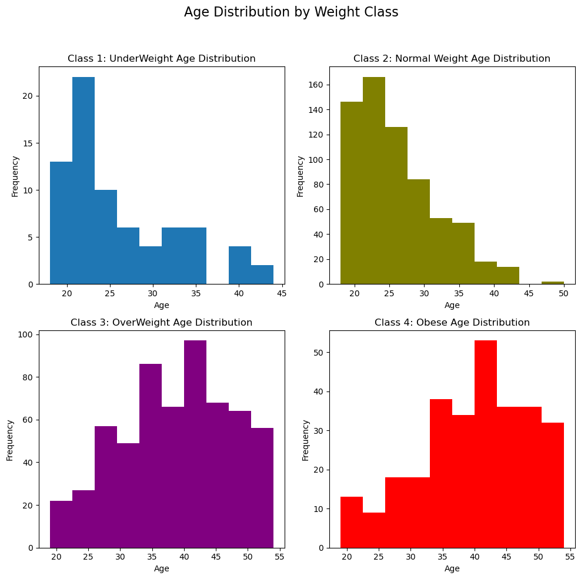
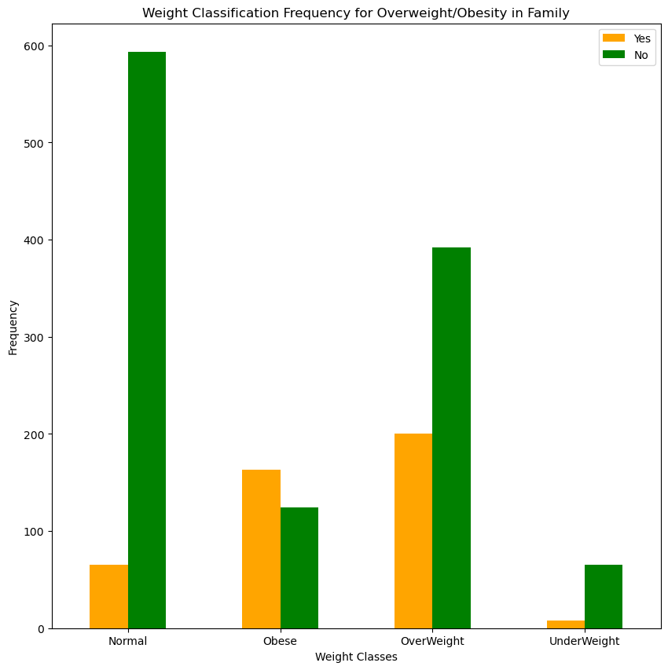
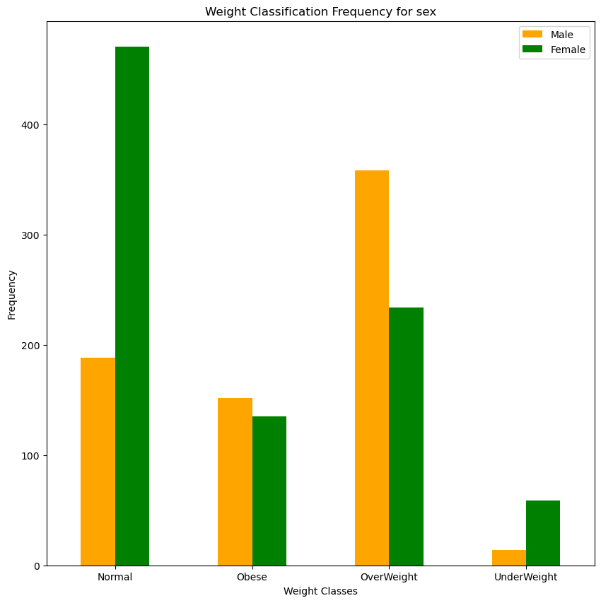
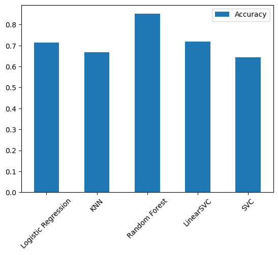
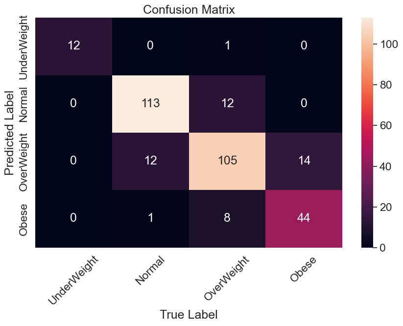
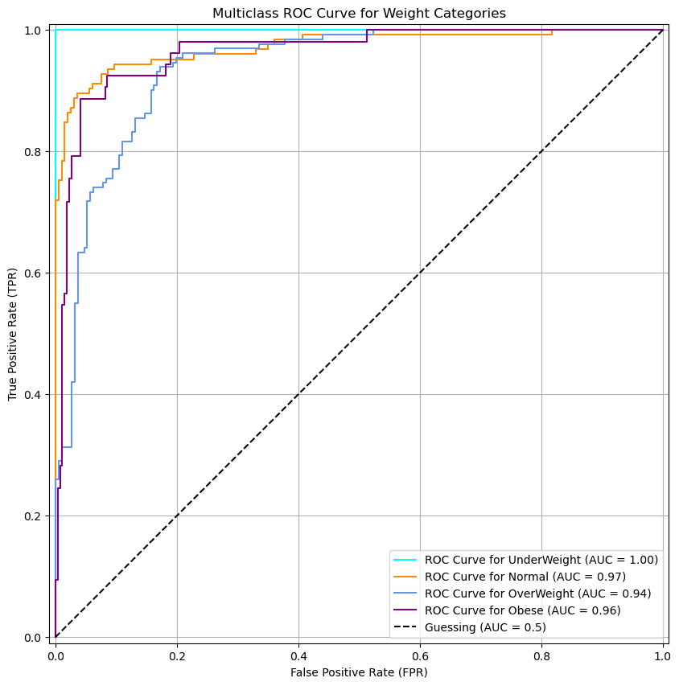
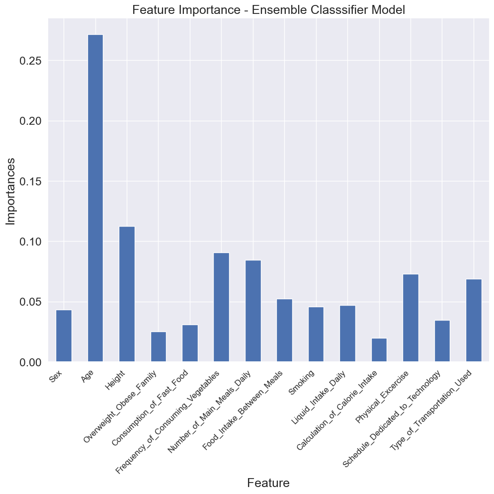
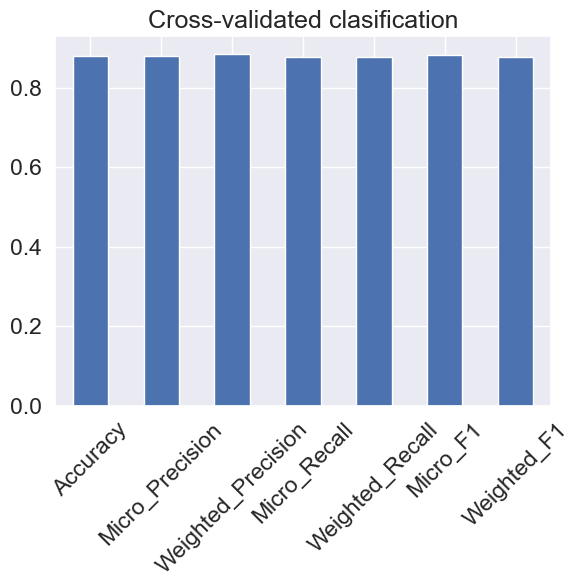

# Weight Classifier
This repository contains a multiclass classification project aimed at classifying a person's weight into predefined weight classes (Underweight, Normal, Overweight, Obese) based on features such as height, age, gender, exercise status etc.


### Project Overview
The anxiety associated with checking one's weight in number is excruciating. Without using the mass (in Kg or lb) of a user, a person can be classified into a weight class using given parameters and that can help them decide on measures to take to curtail excesses and reduce the weight check anxiety.

- **Exploratory Data Analysis**: Which involves going through the data, it's columns and it's rows checking for missing data, correlation, relationships and patterns.

  **Correlation Matrix**
  
A correlation matrix helps understand relationships between numerical features. The values range from -1 to +1, with -1 meaning perfect negative correlation, 0 meaning no Linear relationship and +1 meaning perfect positive correlation.




**Weight Class Distribution**




**Weight Class Distribution by Age**




**Weight Class Distribution by Overweight in Family**




**Weight Class Distribution by Gender**




- **Filling Missing Data**: This is a crucial part of the model creation purpose, Models cannot thoroughly learn from Nan values. The method of filling is crucial.
- **Converting categorical data into Numerical form and encoding them**: As the intro says,this section involves converting all categorical and all object dtypes into Numerical dtypes. This is crucial as Machine learning Models only learn from Numerical data.
- **Modelling and Model Evaluation**: This section involving applying machine learning models to our already clean datase. In this project Ensemble's Random Forest Classifier, Logistic Regression, KNN, SVC, and Linear SVC model were both evaluated and tuned to find which found more pattern and learned better on the data. Random forest classifier learned better and produced a better accuracy score of `87.95%`.

**Model Accuracies**



**Confusion Matrix**

A confusion matrix gives a breakdown of correct and incorrect classsifications for each category. It tells how ad where the model is misclassifying and if a class is over- or under-predicted




**ROC Curve and AUC score**

ROC(Receiver Operating Charactersistic) curve shows the trade-off between sensitivity (true positive rate) and specificity (1 - false positive rate). While the AUC (Area Under Curve) score summarises the ROC, with a score closer to 1 meaning a better model. They both help to tell us how imbalanced classes affect our model.




**Feature Importance of Columns on Ensemble Model**

Feature importances shows how much each column contributed to the final prediction.



**Cross-Validation Evaluation**

Cross validation is applied to Accuracy, Precision, Recall and F1-score to show how much our model actually learns from our data by sampling it different ways and training and testing.




### Installation
1. **Clone The Repository**
	```bash
	git clonehttps://github.com/Darc-lord/Weight-Classifier.git
	cd Weight-Classifier
	```

2. **Download Dataset**
	```bash
	 https://doi.org/10.33484/sinopfbd.1445215
	```	

## Acknoledgements
+ Kaggle
+ Scikit-learn
